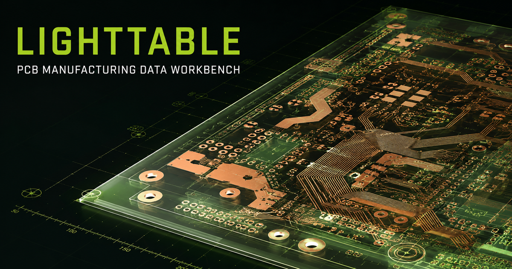
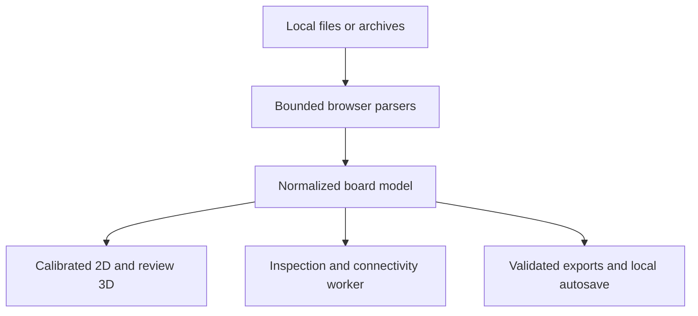

# LIGHTTABLE



LIGHTTABLE is a local-first browser workbench for reading, inspecting, measuring, marking up, lightly editing, and re-exporting printed circuit board manufacturing data.

It is built for engineers, fabricators, technicians, hardware developers, and makers who need a fast way to examine board files without uploading them to a remote service or installing a desktop computer-aided manufacturing suite.

> Current release: **v1.5.2**<br>
> License: **GPL-3.0**<br>
> Standalone runtime dependencies: **None**<br>
> Telemetry: **None**

## Why LIGHTTABLE?

PCB manufacturing packages are often a mixture of Gerber, drill, placement, native design, drawing, and archive formats. LIGHTTABLE brings those files into one browser-based instrument with an explicit fidelity model:

- **Local-first:** imported files stay in the browser.
- **Offline-capable:** the complete instrument is one self-contained HTML file.
- **Format-aware:** supported, approximated, and refused constructs are disclosed.
- **Manufacturing-conscious:** sensitive exports are withheld unless their validation gates pass.
- **Source-preserving:** supported native edits patch the smallest possible source fields and retain unknown content.
- **Responsive:** expensive connectivity analysis runs on demand in a cancellable Web Worker.
- **Review-friendly:** calibrated 2D inspection and an interactive geometry-derived 3D view share the same parsed board model.

LIGHTTABLE is not a replacement for the original electronic design automation system, a fabrication sign-off process, or a source-certified mechanical model. It is an inspection and evidence instrument.

## Quick start

### Run the standalone instrument

1. Download or clone this repository.
2. Open [`public/lighttable.html`](public/lighttable.html) in a current desktop browser.
3. Drop in board files, select a folder, choose a ZIP or TGZ package, or load the included sample.

No installation, server, build process, account, CDN, remote font, or network connection is required.

### Deploy to any static host

Copy `public/lighttable.html` to the desired web directory and rename it `index.html`.

For example, to publish at:

```text
https://example.com/projects/lighttable/
```

place the file at:

```text
/projects/lighttable/index.html
```

The release ZIP follows this layout and can be extracted directly into a static folder.

### Run the repository site wrapper

The repository includes a small Vinext wrapper used to publish the standalone instrument as a full-screen hosted application.

Requirements:

- Node.js 22.13 or newer
- npm

```bash
npm run install:ci
npm run dev
```

For a production validation build:

```bash
npm test
npm run lint
npm run benchmark:lighttable
```

## Primary workflow

```text
INTAKE -> RENDER -> INSPECT -> MARK / EDIT -> OUTPUT
```

1. **Intake:** choose files, a directory, or a supported archive.
2. **Render:** inspect layers in calibrated 2D or the geometry-derived 3D review view.
3. **Inspect:** measure, search, trace named nets, or explicitly analyze derived connectivity.
4. **Mark or edit:** add separate review markup or perform only the native edits supported by the source format.
5. **Output:** export review evidence, preserving native files, or validated manufacturing packages when the fidelity tier permits it.

## Major capabilities

### Board inspection

- Layered 2D canvas with top and bottom views
- Pan, zoom, fit, palette presets, layer visibility, color, and opacity controls
- Resizable board workspace with device-local layout persistence
- Feature selection, board statistics, component and net search
- Snapped point distance and feature-boundary clearance measurement
- Explicit and connected-geometry board outline detection
- PNG, composite PDF, per-layer vector PDF, and print outputs

### Interactive 3D review

- Dependency-free software projection using the same parsed board geometry as 2D
- Orbit, pan, wheel zoom, and isometric, top, and bottom presets
- Persistent Top and Bottom canvas controls that refit the requested 3D side, plus automatic migration of stale camera state after renderer upgrades
- Assembled top and bottom surfaces that hide reverse-side artwork and clip every visible feature to the detected board profile
- PCB material mapping for solder mask, exposed copper, off-white silkscreen, plated holes, board edges, and dark component packages
- Board extrusion, projected drills, and approximate component bodies
- Adjustable board thickness, component height, visibility, and exploded layer spacing
- Component and pad selection with a path back to precise 2D inspection
- Deterministic scene limits for predictable performance on larger jobs

At zero layer separation, the 3D view presents the camera-facing assembled surface. Adding separation deliberately switches to a diagnostic fabrication stack with both sides visible. The 3D view is an orientation and review model. Precise measurement, editing, 1:1 printing, and manufacturing decisions remain in the calibrated 2D view.

### Connectivity analysis

- On-demand geometry-derived networks
- Same-layer copper contact and plated-hole bridges
- Reconciliation of source-net names with derived networks
- Open named-net, source-net conflict, and dangling endpoint detection
- Network tracing and JSON or CSV evidence export
- Cancellable background processing with live progress
- Geometry-revision caching that rejects stale results after real edits

Connectivity is physical evidence derived from supported geometry. It does not reconstruct schematic intent.

### Preserving edits and validated output

- Minimal source-field patches for supported KiCad, Eagle, DXF, and ODB++ transforms
- Diff preview before native write-back
- Unknown-token and unedited-source retention
- Mandatory production-parser reopen validation
- Gerber export with preserved aperture definitions and X2 attributes
- Automatic Gerber re-import and geometry comparison at 0.01 mm
- Separate plated and non-plated Excellon output
- Validated ODB++ ZIP and TGZ output
- Human-readable and machine-readable round-trip evidence

## Format support

| Format | Intake | Native edits | Output | Fidelity |
| --- | --- | --- | --- | --- |
| Gerber RS-274X / X2 | Common lines, arcs, flashes, regions, macros, repeats, polarity, and X2 attributes | Board-model edits | Re-import-certified Gerber | Full or Partial |
| Excellon / XNC | Drills, plating, G85 slots, routed slots, units, and zero suppression | Board-model edits | Separate PTH and NPTH drill files | Full or Partial |
| Gerber job file | Layer ordering metadata | No | Generated job manifest | Full or Partial |
| KiCad `.kicad_pcb` | Selected footprints, pads, segments, and text | Supported move, rotate, and mirror transforms | Preserving native write-back after reopen validation | Partial |
| Altium `.PcbDoc` | Read-only ASCII and bounded binary CFB intake | No | Review evidence only | Partial or Preview |
| Eagle `.brd` / `.eagle` | XML layers, signals, packages, elements, and common package geometry | Element move, 90-degree rotate, and side mirror | Preserving XML write-back after reopen validation | Partial |
| ASCII DXF `.dxf` | Common 2D entities, units, and native layers | Move, rotate, mirror, and delete for supported shapes | Preserving native output or double-reimport-certified generated DXF | Partial |
| ODB++ folder, ZIP, TGZ, or TAR.GZ | Common v7 and v8 text trees | Narrow feature and standalone component transforms | Validated preserving ZIP or TGZ | Partial |
| Placement CSV | Common column layouts | Board-model edits | Placement CSV | Full or Partial |
| ZIP, TAR, or GZIP | Bounded local extraction | No | Format-dependent | Container only |
| IPC-2581, IPC-D-356, BoardView | Not available | No | No | Planned |

Support is intentionally conservative. A recognized file extension does not imply complete semantic coverage.

## Fidelity model

Every loaded board receives one of three visible fidelity tiers:

| Tier | Meaning |
| --- | --- |
| **Full** | No known loss exists in the recognized elements. |
| **Partial** | Unsupported, retained, or approximated elements are named in the Fidelity Report. |
| **Preview** | The board is suitable only for orientation. Measurement and manufacturing output are locked. |

The fabrication package includes `FIDELITY.txt`, `ROUNDTRIP.txt`, and `ROUNDTRIP.json` where applicable. Preserving native exports keep validation evidence in the interface and expose it separately instead of modifying the original source tree with sidecar files.

Never treat a Full result as a substitute for reviewing the exported files in the source electronic design automation or computer-aided manufacturing system.

## Output types

Depending on source format and fidelity, LIGHTTABLE can produce:

- PNG review image
- Composite review PDF
- Per-layer vector PDF package with title blocks and a 50 mm print-check bar
- Browser print view with a 100 mm verification bar
- Placement CSV
- Markup JSON package
- Connectivity JSON and CSV evidence
- Fidelity report
- Preserving KiCad, Eagle, DXF, or ODB++ output
- Certified Gerber, drill, and job ZIP package

The interface hides or locks outputs that are unsafe for the active source.

## Local data and security model

LIGHTTABLE has no runtime network dependency and does not transmit imported board data.

Device-local persistence uses IndexedDB for the active board, annotations, edits, layout settings, selected display mode, and 3D camera state. Use **Fresh Start** to clear the active local session.

All imported content is treated as untrusted. The parsers enforce limits for:

- archive member count and expanded size
- compression ratio and nested containers
- unsafe, absolute, traversal, and duplicate paths
- ZIP CRC and TAR header checksums
- Gerber tokens, features, repeats, apertures, and coordinates
- Excellon tools, records, features, and coordinates
- ODB++ records, member sizes, coordinates, and generated TAR size
- Altium CFB sectors, allocation chains, directories, streams, cycles, and record lengths

Imported text is never evaluated as executable code. Displayed source strings are escaped.

## Important limitations

- Curves used for snapping and boundary clearance are tessellated to a declared 0.01 mm tolerance.
- Connectivity considers supported copper contact and plated-hole geometry, not electrical intent.
- Clear-polarity geometry is excluded as a conductor, but its voids are not yet fully boolean-subtracted during connectivity analysis.
- Browser print scaling must be verified against the included physical scale bar.
- Native editing is deliberately narrow and format-specific. Unsupported objects remain read-only.
- Altium support is read-only. Embedded models, advanced pad stacks, design rules, polygon repour, cavities, and unverified stream families are not fully interpreted.
- The 3D view does not interpret STEP models or embedded Altium 3D bodies. Board stack, materials, mask openings, plated barrels, package shapes, heights, and clearance envelopes remain approximate.
- 3D scenes are bounded to 20,000 visible source features, 3,000 drilled features, and 2,000 component bodies. Larger jobs use deterministic sampling and disclose it.
- Archive intake is bounded to 200 members, 25 MiB per input file, and 80 MiB expanded. Generated TGZ output is limited to a 32 MiB expanded TAR.
- Folder selection and native compression support vary by browser.

See [`TESTING.md`](TESTING.md) for the complete hostile-input and release criteria.

## Performance and quality gates

The v1.5.2 release includes:

- 146 in-app parser, archive, geometry, connectivity, native-write-back, camera-recovery, and 3D assertions
- 29 project-level tests
- A generated-worker execution gate
- A 6,000-feature inspection, connectivity, and 3D benchmark
- A 10,000-record Altium ASCII intake benchmark

| Gate | Release limit |
| --- | ---: |
| Immediate Inspect path | Less than 100 ms |
| Connectivity core, 6,000-feature corpus | Less than 10 s |
| 3D render, 6,000-feature corpus | Less than 250 ms |
| Altium ASCII intake, 10,000 records | Less than 1 s |
| Standalone HTML | Less than 350 KiB |

Run the automated suite:

```bash
npm test
npm run lint
npm run benchmark:lighttable
```

Run the browser harness from **About -> Run self-test**.

## Architecture

The application is intentionally concentrated in one standalone file:



- `public/lighttable.html` contains the production interface, parsers, normalized model, renderers, workers, edit plans, validation, and export logic.
- The hosted wrapper renders that same file full-screen, keeping offline and hosted behavior aligned.
- IndexedDB stores only device-local application state.
- Inline Blob-backed Web Workers isolate expensive analysis without adding deploy-time assets.
- No application server, database, login, CDN, telemetry endpoint, or third-party runtime package is required.

## Repository layout

| Path | Purpose |
| --- | --- |
| `public/lighttable.html` | Complete standalone LIGHTTABLE instrument |
| `app/` | Thin hosted application wrapper and metadata |
| `worker/` | Cloudflare-compatible site entrypoint |
| `tests/` | Project release and regression tests |
| `scripts/lighttable-benchmark.mjs` | Large-job performance gates |
| `TESTING.md` | Manual checks, hostile corpus, and release criteria |
| `CHANGELOG.md` | Version history |
| `BLOG_POST.md` | Project launch article |
| `SHA256SUMS` | Release checksum for the standalone application |
| `vendor/` | Notices for referenced or retained third-party work |

## Contributing

Contributions should preserve LIGHTTABLE's conservative fidelity contract.

1. Fork the repository and create a focused branch.
2. Make the smallest coherent change.
3. Add parser, hostile-input, round-trip, or performance coverage as appropriate.
4. Run the complete test, lint, and benchmark gates.
5. Update `TESTING.md` and `CHANGELOG.md` when behavior or support changes.
6. Open a pull request that describes the input format, expected fidelity, failure behavior, and validation evidence.

Please do not:

- add a runtime network dependency for board processing
- silently reinterpret missing units or malformed coordinates
- claim Full fidelity for an unsupported construct
- unlock manufacturing output for Preview input
- discard unknown native-source content during a supported edit
- include proprietary or customer board files in public issues or fixtures

Synthetic or explicitly redistributable fixtures are preferred.

## Specifications and acknowledgements

ODB++ handling follows the common text-tree structures documented in the [Siemens ODB++Design Format Specification 8.1 Update 4](https://odbplusplus.com/wp-content/uploads/sites/2/2024/08/odb_spec_user.pdf).

Altium binary intake follows the [Microsoft Compound File Binary Format](https://learn.microsoft.com/en-us/openspecs/windows_protocols/ms-cfb/53989ce4-7b05-4f8d-829b-d08d6148375b). Verified PcbDoc storage families and primitive framing were cross-checked against the MIT-licensed [tscircuit altiumts project](https://github.com/tscircuit/altiumts). Its notice is retained in [`vendor/altiumts.LICENSE.md`](vendor/altiumts.LICENSE.md).

## Roadmap

The next v1.x targets under hostile review are:

- IPC-D-356 netlist intake
- IPC-2581 review support
- Read-only BoardView preview
- Practical design-for-manufacturability checks
- Panelisation and production-preparation workflows

New format support will remain gated by explicit fidelity reporting, bounded parsers, hostile-input tests, and reopen or round-trip evidence where output is permitted.

## License

LIGHTTABLE is licensed under the GNU General Public License v3.0.
